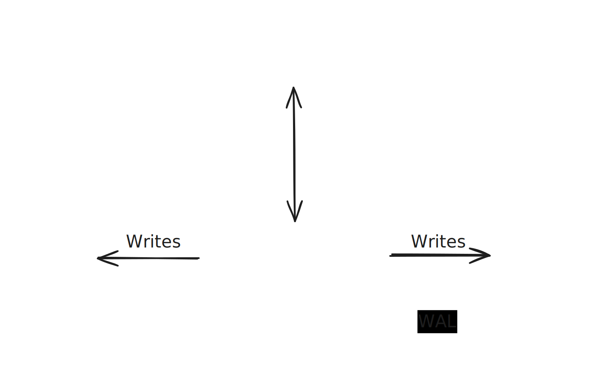

# ReJot - Synchronization Engine

ReJot is a database to database synchronization engine and data catalog for enterprises with distributed architectures and teams.
Our aim is to replace event sourcing and gRPC/REST as a means of sharing data between (micro)services.

Services use their existing database as an interface for remote datasets.
Data owners can publish datasets in a shared catalog, allowing other teams to consume them. Our sync engine tracks changes to these datasets and propagates updates to consumer database in real time.

**Find our hosted solution here:** [app.rejot.dev](https://app.rejot.dev/)

## Open Source Release

We are open-sourcing all components of our platform in this repository. Currently, we have released our control plane application, with plans to open-source the synchronization engine in the near future.

## How it works

- Data dependencies in ReJot are modeled through contracts known as **"Public Schemas"** and **"Consumer Schemas."**
- Public Schemas define how internal datasets are exposed, allowing teams to independently evolve their internal data models while maintaining the contract with consumers.
- ReJot automatically tracks dependencies on these Public Schemas and manages version deprecation.
- Consumers may require different data structures, such as for optimizing specific lookups, which is why they establish their own schemas to explicitly define these mappings.

### Example

This is an example of a Public schema that exposes first and last names of the users table. Our Public Schemas are defined in SQL, where "$1" is the primary key of new/updated table entries.

```sql
SELECT
  "id",
  "first_name",
  "last_name"
FROM
  users
WHERE
  id = $1
```

A hypothetical consumer might need a view of this data, but only cares about the full name. They might setup their Consumer schema as follows, with `$1`, `$2`, `$3` as the numbered fields from the public schema:

```sql
INSERT INTO
  replicated_users (id, full_name)
VALUES
  ($1, CONCAT($2, ' ', $3))
ON CONFLICT (id) DO UPDATE
SET
  full_name = CONCAT($2, ' ', $3)
```

ReJot's synchronization engine monitors the write-ahead log (WAL) of producer databases.
Once updates happen it applies any transformations and upserts the changes into the consumer's datastore.
Because ReJot uses an internal, database-agnostic representation of table updates, it can synchronize across various datastore technologies.

## Architecture Overview

- **Control plane**: Services publish their public schema to the data catalog for other services in the organization to consume. Keeps track of clients subscribed to these schemas and orchestrates the sync engine(s) to move data where needed.
- **Sync Engine**: Consumes the write-ahead log of a data store and pushes updates to published schemas to clients subscribed to those schemas. This data is made available to services in their local data store.



## Project Structure

This monorepo will contain all components needed to operate ReJot.

```
rejot/
├── apps/
│   ├── controller/      # Control plane API Server
│   └── controller-spa/  # Control plane UI
└── packages/            # Shared libraries
```

## Design Partner

We're looking for design partners in need of a better distributed architecture. You can [contact us here!](https://rejot.dev/contact)

## Contributing

We welcome contributions! Since the project is evolving rapidly, please **create an [issue](https://github.com/rejot-dev/rejot/issues/new) before submitting a pull request** to discuss your changes.
