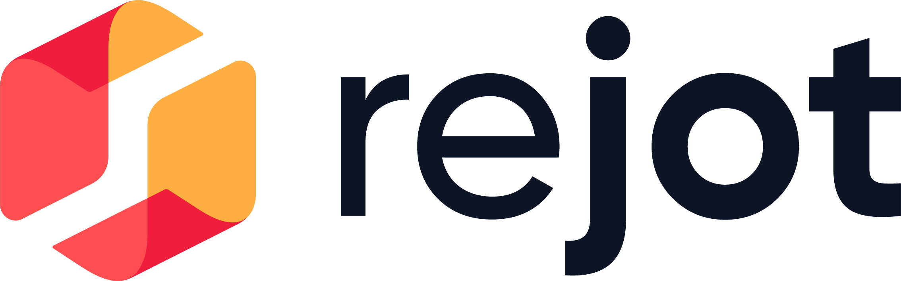
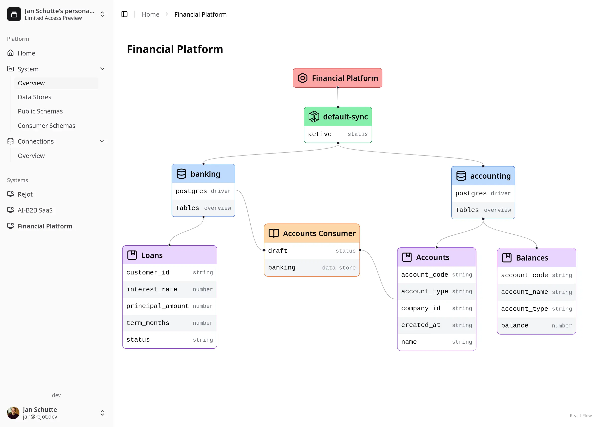
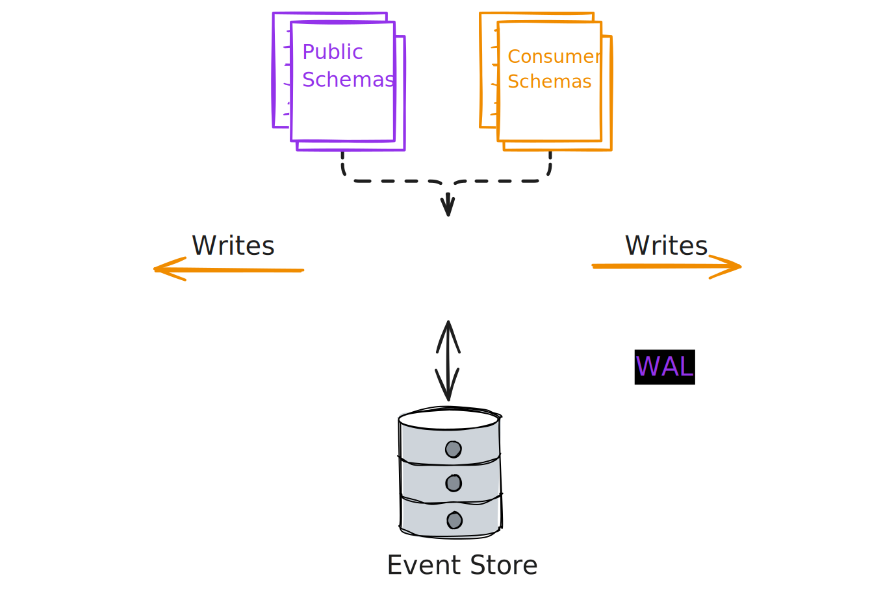

<h1 align="center">
  <a href="https://rejot.dev">
    <picture>
      <source height="100px" media="(prefers-color-scheme: dark)" srcset="./resources/rejot-logo-text-white.png">
      <source height="100px" media="(prefers-color-scheme: light)" srcset="./resources/rejot-logo-text-black.png">
      
    </picture>
  </a>
</h1>

<p align="center">
  <b>Supercharged Replication:</b>
  <i>Turn the write-ahead log of your database into an asynchronous communication channel for your services 🚀</i>
</p>

<h4 align="center">
  <a href="https://rejot.dev/docs/start/quickstart/">Quickstart</a>
  |
  <a href="https://rejot.dev/docs/">Docs</a>
  |
  <a href="https://x.com/ReJotSync">Follow on X</a>
</h4>

<p align="center">
    
</p>

## Introduction

ReJot is the missing middle-ground solution between synchronous inter-service communication
(REST/SOAP) and asynchronous event streaming (like Kafka).

Our solution is based on database replication with a focus on developers (as opposed to
infrastructure). With ReJot, you define what to publish and consume using your database's query
language. The transformations and schemas are co-located with a service's internal data model.

We solve the problem of fragile service calls and compounding latency issues that arise from
synchronous microservice communication by being an asynchronous alternative. At the same time we can
avoid the operational complexity that Kafka brings by re-using your database's changelog as a queue.
Making ReJot a lightweight addition to your infrastructure.

Replication is managed in your codebase using
[Public and Consumer Schemas](https://rejot.dev/docs/guides/defining-schemas/). Our CLI collects
these into a [Manifest](https://rejot.dev/docs/guides/managing-manifests/) which is then used by our
sync engine to replicate the data (see [Architecture Overview](#architecture-overview) below).

## Quickstart

See our [Quickstart Guide](https://rejot.dev/docs/start/quickstart/) to get started.

TL;DR:

- Install the `rejot-cli` (using Node / Bun)
- Setup a Postgres database with logical replication enabled
- Initialize a manifest & add database connections
- Define your Public & Consumer schemas
- Start replicating!

### Installing

Get started with ReJot through `rejot-cli`. You'll need to have [Node.js](https://nodejs.org/) or
[Bun](https://bun.sh) installed to run it.

```bash
npm install -g @rejot-dev/cli
```

### Setting up a Manifest

(Assuming `$MY_SOURCE_DB` and `$MY_SINK_DB` are Postgres connection strings)

```bash
rejot-cli manifest init --slug "rejot-test" && \
  rejot-cli manifest connection add --slug source --connection-string $MY_SOURCE_DB && \
  rejot-cli manifest datastore add --connection source --publication my_rejot_publication --slot my_rejot_slot && \
  rejot-cli manifest connection add --slug sink --connection-string $MY_SINK_DB && \
  rejot-cli manifest datastore add --connection sink
```

Now `rejot-cli manifest info` should show your manifest and the connections you've added. We'll
create the publication and replication slot for you when first starting a sync.

### Public Schema

A public schema defines how a service's internal data model is transformed into a new data model
that can be consumed by other services. It is executed once for every change in the source data
store.

```ts
createPublicSchema("my-public-schema", {
  source: { dataStoreSlug: "source" },
  outputSchema: z.object({ id: z.string(), apiKey: z.string() }),
  config: {
    publicSchemaType: "postgres",
    transformations: [
      ...createPostgresPublicSchemaTransformations(
        "insertOrUpdate",
        "api_key",
        `SELECT id, key AS "apiKey" FROM api_key WHERE id = :id`,
      ),
    ],
  },
  version: { major: 1, minor: 0 },
});
```

### Consumer Schema

A consumer schema references a public schema and defines how the data is stored in the sink data
store.

```ts
createConsumerSchema("my-consumer-schema", {
  source: {
    manifestSlug: "rejot-test",
    publicSchema: { name: "my-public-schema", majorVersion: 1 },
  },
  config: {
    consumerSchemaType: "postgres",
    destinationDataStoreSlug: "sink",
    sql: `INSERT INTO target_table (id, api_key) VALUES (:id, :apiKey)
          ON CONFLICT (id) DO UPDATE SET api_key = :apiKey`,
  },
});
```

### Collecting Schemas

The `rejot-cli` is used to collect all schemas in a given codebase into the ReJot manifest file.

```bash
rejot-cli collect --check --print ./schemas.ts
```

If all looks good, you can materialize the schemas into your manifest. This will auto-discover the
manifest file.

```bash
rejot-cli collect --write ./schemas.ts
```

### Start Synchronization

```bash
rejot-cli manifest sync ./rejot-manifest.json
```

## How it works

- Data dependencies in ReJot are modelled through Data Contracts known as **Public Schemas** and
  **Consumer Schemas**. These contracts are defined by developers in code.
- Public Schemas define how internal datasets are exposed, allowing teams to independently evolve
  their internal data models while maintaining the contract with consumers. A transformation is
  required to expose data, which encapsulates the internal data model.
- Consumers at the same time can ingest these data sources by setting up a Consumer Schema, pointing
  to a specific Public Schema and version.
- ReJot connects to the publishing databases's write-ahead log (WAL) and pushes changes to Public
  schemas to the data stores on the consuming side.
- An intermediate event store is used as durable storage to store these updates.

## Architecture Overview

The overview below shows how ReJot operates in a microservice architecture where each service has
its own data store.

- **Sync Engine**: Consumes the write-ahead log of a data store and applies the public schema
  transformations to the rows changed in that data store. It stores these public schema
  events/messages in the event store and handles writing the mutations to the destination data
  store.
- **Event Store**: A durable storage backend for public schema events.

<p align="center">
    
</p>

Note that this diagram shows the "sync engine" as a singular monolithic service. In practice, a sync
service is a stateless service that can be deployed in a highly-available manner. Only one instance
can be active on a given WAL, but stand-bys can take over and also service data from the event
store. Each service exposes a `/read` route where a client can obtain events from a certain offset.

Each instance of a sync service runs based on a manifest file. We're operating based on a philosophy
where in enterprise environments, services and their accompanying databases are typically owned by a
team. We expect each unit of ownership (service + db) to have a manifest, in which consumer schemas
will reference public schemas in manifests owned by other teams. This means each referenced manifest
slug needs to be resolved to a sync service running somewhere. This is done through
[resolvers](https://rejot.dev/docs/reference/resolvers/).

## Demo

The ["ShopJot" example repository](https://github.com/rejot-dev/example-microservice-ts) contains a
demo webshop application called ShopJot, built using a microservices architecture with Typescript.
It showcases how ReJot can be used to synchronize data between different services (which would
typically be owned by different teams).

You can find it live at [example.rejot.dev](https://example.rejot.dev).

## Contributing

We welcome contributions! Since the project is evolving rapidly, please **create an
[issue](https://github.com/rejot-dev/rejot/issues/new) before submitting a pull request** to discuss
your changes first.

For any general questions, feel free to [contact us here](https://rejot.dev/contact).

## Thanks!

We'd be grateful if you could star ⭐️ the repo and share it with others!

Feel free to join the [GitHub discussions](https://github.com/rejot-dev/rejot/discussions/120) to
say hi or ask questions!
